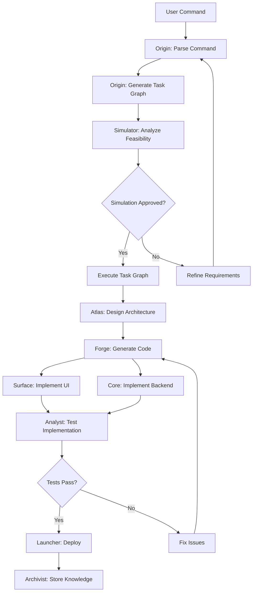

# AgentForgeOS V2 Architecture

This comprehensive guide explains the architecture of AgentForgeOS V2, covering the layered design, agent system, orchestration engine, and integration patterns that enable intelligent multi-agent software development.

## 🏗️ System Architecture Overview

AgentForgeOS V2 follows a **strict layered architecture** with clear separation of concerns, ensuring maintainability, scalability, and security.

```
┌─────────────────────────────────────────────────────────────┐
│                    Desktop Layer                            │
│                 Tauri Application                          │
└─────────────────────────────────────────────────────────────┘
                              │
┌─────────────────────────────────────────────────────────────┐
│                    Engine Layer                             │
│              FastAPI Runtime System                        │
└─────────────────────────────────────────────────────────────┘
                              │
┌─────────────────────────────────────────────────────────────┐
│                   Control Layer                            │
│              Security & Governance                         │
└─────────────────────────────────────────────────────────────┘
                              │
┌─────────────────────────────────────────────────────────────┐
│                Orchestration Layer                         │
│            Task Graph Execution Engine                      │
└─────────────────────────────────────────────────────────────┘
                              │
┌─────────────────────────────────────────────────────────────┐
│                  Agent System                              │
│              12 Specialized AI Agents                       │
└─────────────────────────────────────────────────────────────┘
                              │
┌─────────────────────────────────────────────────────────────┐
│                Knowledge & Build                           │
│        Neo4j/Qdrant + Simulation + Sandbox                │
└─────────────────────────────────────────────────────────────┘
```

## 📚 Layer Responsibilities

### Desktop Layer
- **Purpose**: Native desktop application wrapper
- **Technology**: Tauri + Rust
- **Responsibilities**:
  - Application lifecycle management
  - System integration (file dialogs, notifications)
  - Local engine process management
  - Cross-platform deployment

### Engine Layer
- **Purpose**: Core runtime and API server
- **Technology**: FastAPI + Python
- **Responsibilities**:
  - RESTful API endpoints
  - WebSocket real-time communication
  - Request routing and validation
  - Authentication and authorization
  - File serving and static assets

### Control Layer
- **Purpose**: Security, governance, and compliance
- **Technology**: Security middleware + Policy engine
- **Responsibilities**:
  - Access control and authentication
  - Request validation and sanitization
  - Rate limiting and resource quotas
  - Audit logging and compliance
  - Anti-drift rule enforcement

### Orchestration Layer
- **Purpose**: Task graph execution and coordination
- **Technology**: Async task engine + State machine
- **Responsibilities**:
  - Task graph creation and validation
  - Agent coordination and scheduling
  - Dependency management
  - State tracking and persistence
  - Error handling and recovery

### Agent System
- **Purpose**: Specialized AI agents for different development tasks
- **Technology**: AI model integration + Agent framework
- **Responsibilities**:
  - Domain-specific task execution
  - Tool usage and API integration
  - Collaboration and communication
  - Learning and adaptation
  - Quality assurance

### Knowledge & Build Layer
- **Purpose**: Knowledge management and build execution
- **Technology**: Neo4j + Qdrant + Docker
- **Responsibilities**:
  - Knowledge graph storage and retrieval
  - Vector similarity search
  - Build simulation and feasibility
  - Sandboxed code execution
  - Artifact management

## 🤖 The 12-Agent System

AgentForgeOS V2 features exactly 12 specialized agents, each with distinct roles and capabilities:

### Command & Planning Agents

#### 1. Origin (Commander)
- **Role**: Command interpretation and initial planning
- **Responsibilities**:
  - Parse and understand user commands
  - Classify project type and complexity
  - Generate initial task graph
  - Define project scope and requirements
- **Tools**: NLP models, command parser, project classifier

#### 2. Atlas (Architect)
- **Role**: System architecture and high-level design
- **Responsibilities**:
  - Design system architecture
  - Define module boundaries
  - Specify data models and interfaces
  - Choose technology stack
- **Tools**: Architecture patterns, framework selector, design tools

### Implementation Agents

#### 3. Forge (Builder)
- **Role**: Code generation and project scaffolding
- **Responsibilities**:
  - Generate project directory structure
  - Create boilerplate code and configurations
  - Implement basic functionality
  - Set up development environment
- **Tools**: Code generators, template engines, scaffolding tools

#### 4. Surface (Frontend Engineer)
- **Role**: User interface development
- **Responsibilities**:
  - Implement UI components and pages
  - Create responsive layouts
  - Handle user interactions
  - Integrate with backend APIs
- **Tools**: React/Vue, CSS frameworks, UI libraries

#### 5. Core (Backend Engineer)
- **Role**: Backend systems and API development
- **Responsibilities**:
  - Implement business logic
  - Create RESTful APIs
  - Handle data persistence
  - Manage authentication and security
- **Tools**: FastAPI/Django, databases, API frameworks

#### 6. Fabricator (Game Engine Engineer)
- **Role**: Game engine integration and 3D development
- **Responsibilities**:
  - Unity/Unreal project setup
  - Game logic implementation
  - 3D asset integration
  - Performance optimization
- **Tools**: Unity, Unreal Engine, 3D modeling tools

### Integration & Support Agents

#### 7. Synapse (AI Engineer)
- **Role**: AI model integration and routing
- **Responsibilities**:
  - Select appropriate AI models
  - Manage model routing and load balancing
  - Handle embeddings and inference
  - Optimize AI usage and costs
- **Tools**: fal.ai, OpenAI, model routing frameworks

#### 8. Guardian (Security Engineer)
- **Role**: Security validation and vulnerability assessment
- **Responsibilities**:
  - Review code for security issues
  - Implement security controls
  - Validate authentication and authorization
  - Ensure compliance with security standards
- **Tools**: Security scanners, penetration testing tools

#### 9. Analyst (Testing Engineer)
- **Role**: Quality assurance and testing
- **Responsibilities**:
  - Design test strategies
  - Implement automated tests
  - Perform quality validation
  - Generate test reports
- **Tools**: Testing frameworks, CI/CD tools, quality metrics

#### 10. Launcher (DevOps Engineer)
- **Role**: Deployment and operations
- **Responsibilities**:
  - Create deployment configurations
  - Set up CI/CD pipelines
  - Monitor system performance
  - Handle scaling and reliability
- **Tools**: Docker, Kubernetes, cloud platforms

### Knowledge & Research Agents

#### 11. Archivist (Research Agent)
- **Role**: Knowledge extraction and management
- **Responsibilities**:
  - Extract patterns from projects
  - Manage knowledge graph
  - Research best practices
  - Provide learning resources
- **Tools**: Knowledge graphs, vector databases, research tools

#### 12. Simulator (Build Simulation)
- **Role**: Build feasibility analysis and simulation
- **Responsibilities**:
  - Analyze project complexity
  - Estimate timelines and costs
  - Assess technical feasibility
  - Generate build reports
- **Tools**: Simulation engines, complexity analyzers, cost models

## 🔄 Task Graph Execution

### Deterministic Task Graphs

AgentForgeOS uses **deterministic task graphs** to ensure predictable, reproducible execution:



### Recursive Build Loop

The system implements a **6-stage recursive build loop**:

1. **Plan** - Define requirements and approach
2. **Build** - Generate and implement code
3. **Test** - Validate quality and functionality
4. **Review** - Assess results and identify issues
5. **Refine** - Fix issues and improve implementation
6. **Rebuild** - Re-execute with improvements

### Artifact Truth Principle

**Files on the filesystem define success and state**:
- Each task produces specific artifacts
- Artifacts are validated for completeness
- Task dependencies are based on artifact availability
- System state is derived from artifact analysis

## 🧠 Knowledge Graph Integration

### Neo4j Integration

The knowledge graph stores:
- **Project relationships** - Dependencies and connections
- **Agent interactions** - Collaboration patterns
- **Technology patterns** - Successful combinations
- **Best practices** - Proven approaches

```cypher
// Example: Project relationship query
MATCH (p1:Project)-[r:SIMILAR_TO]->(p2:Project)
WHERE p1.type = 'web-app' AND p2.complexity = 'medium'
RETURN p1.name, p2.name, r.similarity_score
```

### Qdrant Vector Search

Vector database enables:
- **Semantic search** - Find similar projects by description
- **Pattern matching** - Identify code and architecture patterns
- **Recommendations** - Suggest technologies and approaches
- **Learning** - Improve recommendations over time

## 🔒 Security Architecture

### Anti-Drift Rules

Strict architectural controls prevent deviation:

1. **3-Page Frontend Rule** - Exactly 3 UI pages allowed
2. **12-Agent Rule** - No more or fewer agents permitted
3. **Layer Isolation** - No cross-layer dependencies
4. **Artifact Contracts** - Fixed input/output specifications

### Security Controls

Multi-layered security approach:
- **Input Validation** - All inputs sanitized and validated
- **Sandboxing** - Docker isolation for code execution
- **Access Control** - Role-based permissions
- **Audit Logging** - Complete activity tracking
- **Rate Limiting** - Resource protection

## 🚀 Performance Architecture

### Scalability Design

- **Horizontal Scaling** - Multiple engine instances
- **Agent Parallelism** - Concurrent agent execution
- **Resource Management** - CPU and memory limits
- **Load Balancing** - Request distribution
- **Caching** - Multi-level caching strategy

### Real-time Updates

WebSocket-based real-time communication:
- **Task Status** - Live task execution updates
- **Agent Activity** - Real-time agent monitoring
- **Build Progress** - Continuous build status
- **System Events** - Immediate error notifications

## 🔧 Integration Patterns

### Model Routing

Intelligent AI model selection and routing:
- **Cost Optimization** - Choose most cost-effective models
- **Performance Optimization** - Select fastest suitable models
- **Fallback Logic** - Multiple provider support
- **Usage Tracking** - Monitor and optimize usage

### Game Engine Integration

Unity and Unreal Engine support:
- **Project Generation** - Automatic project setup
- **Build Automation** - Automated build processes
- **Asset Management** - 3D asset integration
- **Performance Optimization** - Build optimization

### Local Bridge System

Local machine integration:
- **File System Access** - Secure file operations
- **Process Management** - External tool execution
- **System Integration** - OS-level features
- **Security Boundaries** - Sandboxed access

## 📊 Monitoring & Observability

### System Metrics

Comprehensive monitoring includes:
- **Task Performance** - Execution time and success rates
- **Agent Efficiency** - Individual agent performance
- **Resource Usage** - CPU, memory, and storage
- **Error Rates** - Failure analysis and tracking
- **User Activity** - Interaction patterns and usage

### Logging Strategy

Structured logging provides:
- **Event Correlation** - Track related events
- **Performance Analysis** - Identify bottlenecks
- **Security Auditing** - Track security events
- **Debugging Support** - Detailed troubleshooting data

## 🎯 Architecture Benefits

### Predictable Execution
- Deterministic task graphs ensure reproducible results
- Fixed agent roles provide consistent behavior
- Artifact contracts guarantee reliable outputs

### Scalable Design
- Layered architecture supports independent scaling
- Agent parallelism enables concurrent execution
- Resource management prevents overload

### Secure by Design
- Multiple security layers prevent vulnerabilities
- Sandboxing isolates potentially dangerous operations
- Anti-drift rules maintain architectural integrity

### Intelligent Learning
- Knowledge graph captures project insights
- Vector search enables intelligent recommendations
- Pattern recognition improves over time

## 🔮 Future Architecture Evolution

The architecture is designed for evolution:
- **Plugin Architecture** - Extensible agent system
- **Multi-Cloud Support** - Cloud-agnostic deployment
- **Advanced AI** - Next-generation model integration
- **Enhanced Security** - Zero-trust architecture

This architecture provides the foundation for AgentForgeOS V2's mission to revolutionize software development through intelligent agent collaboration while maintaining security, performance, and reliability.
